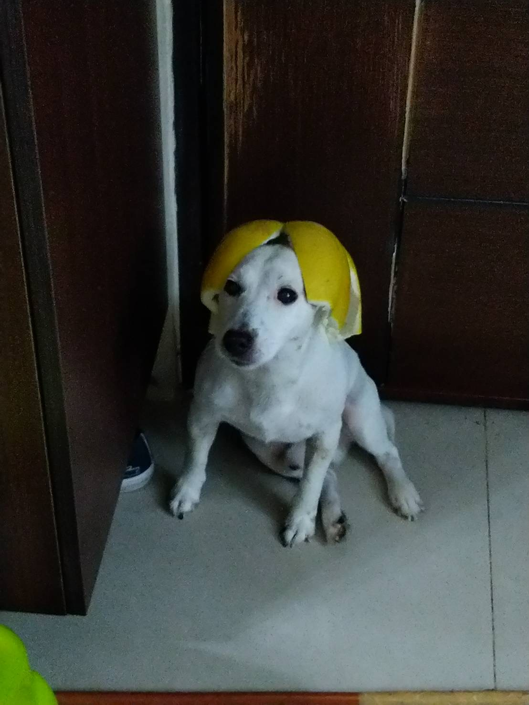

### Hi there 👋

Hi! I’m an undergraduate student in Electrical Engineering at National Taiwan University. I am currently employed as a Research Assistant in CFDA & CLIP Labs, Research Center of Information Technology Center, Academia Sinica.

My research interests focus on Data Science. In particular, I aim to optimize the performance of Recommendation System. I'm interested in developing embedded system as well.

BTW Garlic is my cute dog 🐶

<!--
Here are some ideas to get you started:

- 🔭 I’m currently working on ...
- 🌱 I’m currently learning ...
- 👯 I’m looking to collaborate on ...
- 🤔 I’m looking for help with ...
- 💬 Ask me about ...
- 📫 How to reach me: ...
- 😄 Pronouns: ...
- ⚡ Fun fact: ...
-->
